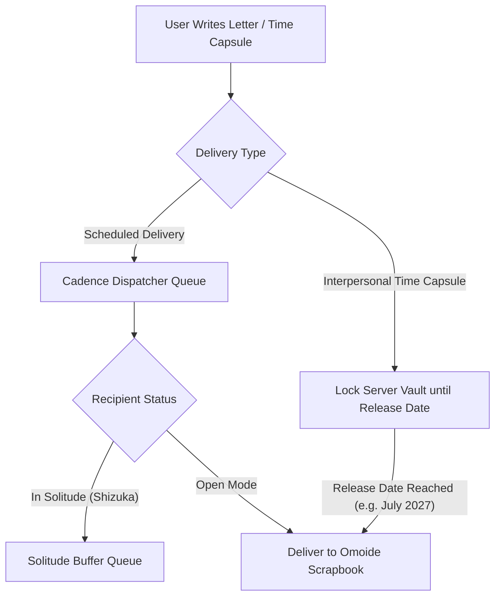

# APPLICATION DOCUMENT: OGIS CONTEST 2026

**PROJECT TITLE:** Kizuna (絆) — The Purposeful Connection Platform  
**SUBTITLE:** Redesigning Connections: Shifting from Megaplatform Bloat ("Broad & Shallow") to Purposeful Intimacy ("Narrow & Deep")  
**THEME:** Tsunagaranai Kachi (つながらない価値) — Disconnected by Design  
**TEAM NAME:** Team Antigravity  
**DOCUMENT FORMAT:** Letter-Size (Portrait), Calibri 10pt, 6-Page Executive Proposal Structure  

---

## 1. SUMMARY OF THE IDEA

**Kizuna (絆)** is a purposeful connection platform that de-clusters modern social media bloatware. Instead of forcing users into an endless cycle of news feeds, viral algorithm loops, ad noise, and vanity follower counters, **Kizuna intentionally redesigns digital relationships around intimacy, boundaries, and shared memory.**

Kizuna establishes a dual **Interpersonal vs. Intrapersonal Framework**:
* **Interpersonal Connection:** Anchored by a **15-friend Inner Circle cap (Sanctuary)**, **flexible delivery pacing (3x/week, 5x/week, or Sunday Digest)**, **locked Time Capsules & 1-on-1 scrapbooks (Omoide - 思い出)** with annual reflections (*Kizuna Wrapped*), and **3–5 friend living room circles (Fireside)**.
* **Intrapersonal Solitude:** Anchored by **Shizuka (静か)**, a private focus shield and self-reflection space designed for quiet introspection away from social pressure.

```
 ┌──────────────────────────────────────────────────────────────────────────┐
 │                               KIZUNA (絆)                                │
 │               Interpersonal Bonds  ──  Intrapersonal Solitude            │
 └────────────────────────────────────┬─────────────────────────────────────┘
                                      │
       ┌──────────────────────────────┼──────────────────────────────┐
       ▼                              ▼                              ▼
 ┌───────────┐                  ┌───────────┐                  ┌───────────┐
 │1. Sanctuary│                 │ 2. Omoide │                  │3. Fireside│
 │ (15 Cap & │                  │ (Time     │                  │  (Circles)│
 │ Cadence)  │                  │ Capsules) │                  │           │
 └─────┬─────┘                  └─────┬─────┘                  └─────┬─────┘
       │                              │                              │
       └──────────────────────────────┼──────────────────────────────┘
                                      │
                                      ▼
                        ┌───────────────────────────┐
                        │ 4. Shizuka (静か) Shield  │
                        │   (Intrapersonal Space)   │
                        └───────────────────────────┘
```

---

## 2. AIM & BACKGROUND RATIONALE

### 2.1 The Crisis of the "Megaplatform"
In today’s digital ecosystem, social media has evolved into overwhelming **megaplatforms** housing news, e-commerce, corporate work channels, influencer marketing, and short-form video algorithms under one roof. Looking through the lens of everyday people, this constant exposure is mentally exhausting and emotionally hollow.

### 2.2 The Shift from "Narrow & Deep" to "Broad & Shallow"
As highlighted in the OGIS background slides, constant connectivity has fundamentally altered human relationships:
* **The Follower Counter Illusion:** Friends, family, and peers are reduced to a numerical "counter" (500+ contacts). Users feel social pressure to maintain broadcast visibility to people they rarely speak to.
* **Transactional Communication:** Interactions have become transactional—quick emoji reactions, broadcast stories, and meme drops devoid of genuine human warmth.
* **Neglect of Intrapersonal Solitude:** Constant notification noise deprives individuals of quiet self-reflection, creating anxiety and digital burnout.

---

## 3. CORE ARCHITECTURAL FEATURES

### 3.1 Sanctuary (Inner Circle Boundary & Stress-Free Pacing)
* **The 15-Friend Cap (Dunbar Boundary):** Grounded in evolutionary psychology (Dunbar’s number for close support relationships), users can only hold up to 15 active connections in their Sanctum. To add a new active connection, a user must intentionally evaluate their inner life.
* **Flexible Delivery Cadence:** Delivery is **never forced daily**, preventing notification fatigue. Users configure their preferred delivery pacing (3x/week, 5x/week, or Sunday Digest).
* **Fading Seasons Archive:** Inactive relationships peacefully transition into a quiet memory archive without awkward un-friending or social penalty.

### 3.2 Omoide (思い出) (Interpersonal 1-on-1 Canvas & Time Capsules)
* **Interpersonal Time Capsules:** Friends can co-create digital Time Capsules containing letters, photo memories, and 60-second voice journals that remain **locked until a future date** (e.g. 1 year later, graduation day, or a planned reunion).
* **Private Shared Timeline:** A 2-person visual scrapbook that accumulates shared memories over time with **zero public likes, view counts, or clout metrics**.
* **Kizuna Wrapped (Annual Relationship Reflection):** Inspired by Spotify Wrapped, Omoide automatically compiles a private, co-created yearly relationship reflection between two friends.

### 3.3 Fireside (Micro-Group Living Room Circles)
* **Micro-Group Rooms (3–5 Friends):** Private rooms for tight-knit groups away from public feeds and chaotic group chats.
* **Weekly Reflective Prompt:** The system delivers one deep, reflective question per week (e.g., *"What is something you've been quietly carrying this month?"*).
* **The Unveil (Simultaneous Reveal):** All members write their responses privately; answers unlock for the circle only when all members submit, fostering genuine vulnerability without instant-reply anxiety.

### 3.4 Shizuka (静か) (Intrapersonal Solitude Shield & Dark Mode)
* **Intrapersonal Self-Reflection Journal:** A private sanctuary for the user's own mind, providing quiet mood check-ins and personal journaling away from social performance.
* **Zero Dopamine Triggers:** Eliminates red notification badges, read receipts, typing indicators, and intrusive popup banners.
* **Full Dark/Night Mode:** A calming dark paper palette (`#181716` background, soft sepia text, warm gold borders) for nighttime solitude.

---

## 4. SYSTEM PROCESS & DATA MODELING

### 4.1 Relationship & Time Capsule Lifecycle Flow



---

## 5. ALIGNMENT WITH OGIS EVALUATION CRITERIA

1. **Tsunagaranai Kachi (Value of Disconnection):**
   * Kizuna embraces disconnection from megaplatform noise, notification anxiety, and vanity follower counts, proving that distance and solitude make real connection meaningful.
2. **Interpersonal & Intrapersonal Balance:**
   * Restructures social connection while protecting intrapersonal solitude—allowing individuals to reflect on themselves before connecting with close friends.
3. **Redesigning Connections:**
   * Directly restructures network topology, message delivery queues, and shared memory storage to prioritize "narrow & deep" human bonds over "broad & shallow" metrics.

---

*Generated for Team Antigravity | OGIS Philippines 2026*
